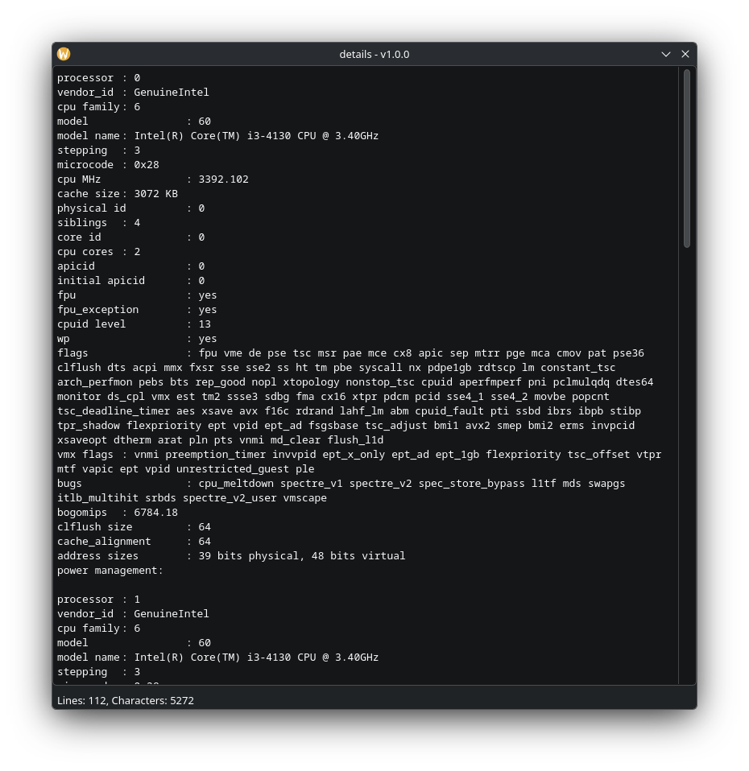

<div>
    
    <h3 align="center">details</h3>
    <p align="center">by, clangjesus</h3>
    <hr>
</div>
When piped, `details` will show the output from
the piped output into a GUI window. This makes it
easier to look at/for things such as logs, error
messages etc.

## Usage

### Example 1
```commandline
$ wine game.exe |& details
```

### Example 2
```commandline
$ <TODO>
```

### Building
To install `details`, run `qmake` on the project's
root directory.

### Installing
Run `bash ./install.sh`.

## License
MIT.

<h1 align="center">clangjesus</h1>
